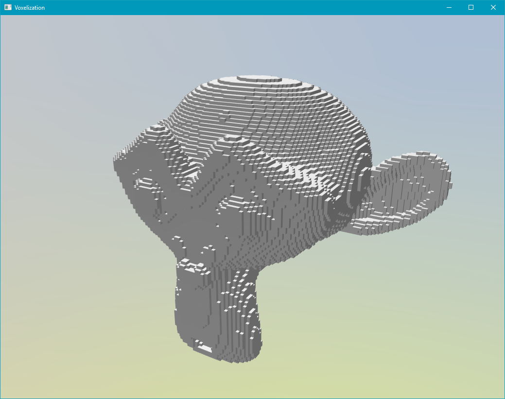
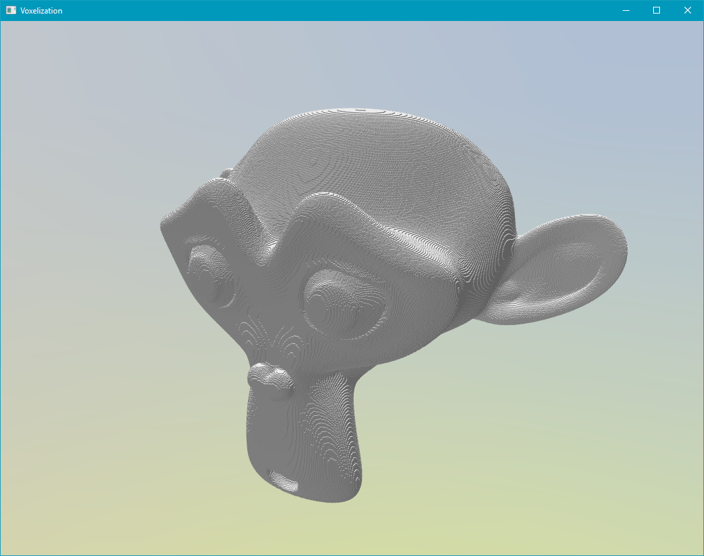

# voxelizer-gpu
Mesh surface thin voxelization using GPU hardware rasterization.
Uses OpenGL 3.3+ core profile.

# Usage
Use the mouse left button to navigate, LShift+ mouse left button to move the light.

Press O or P to decrease/increase precision.

# Screenshots

# Performance
I performed my tests with my integrated Intel HD 4400 under both Linux and Windows. Interestingly, under Linux the computation was faster but at the cost a few glitches and a lower highest supported resolution.

The model used is Suzanne (31,000 vertices).
Grid 64x64x64: 2 ms
Grid 128x128x128: 9 ms
Grid 256x256x256: 10 ms
Grid 512x512x512: 120 ms

# COMPILATION
To compile this project requires SFML 2.3.2 and GLEW to compile (see Makefile).

